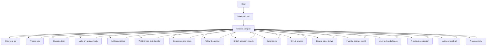

## Every page, every route

Only the starter comes first. Return to the choices after any page.

```mermaid
flowchart TD
  Start["Start"] --> P1A["Meet your pet"]
  P1A --> Hub["Choose any part"]
  Hub --> P2A["Click your pet"]
  P2A --> Hub
  Hub --> P2B["Press a key"]
  P2B --> Hub
  Hub --> P3A["Shape a body"]
  P3A --> Hub
  Hub --> P3B["Make an angular body"]
  P3B --> Hub
  Hub --> P3C["Add decorations"]
  P3C --> Hub
  Hub --> P4A["Wobble from side to side"]
  P4A --> Hub
  Hub --> P4B["Bounce up and down"]
  P4B --> Hub
  Hub --> P4C["Follow the pointer"]
  P4C --> Hub
  Hub --> P5A["Switch between moods"]
  P5A --> Hub
  Hub --> P5B["Surprise me"]
  P5B --> Hub
  Hub --> P5C["Give it a voice"]
  P5C --> Hub
  Hub --> P6A["Draw a place to live"]
  P6A --> Hub
  Hub --> P6B["Invent a strange world"]
  P6B --> Hub
  Hub --> P7A["Meet test and change"]
  P7A --> Hub
  Hub --> P8A["A curious companion"]
  P8A --> Hub
  Hub --> P8B["A sleepy oddball"]
  P8B --> Hub
  Hub --> P8C["A space visitor"]
  P8C --> Hub
```
